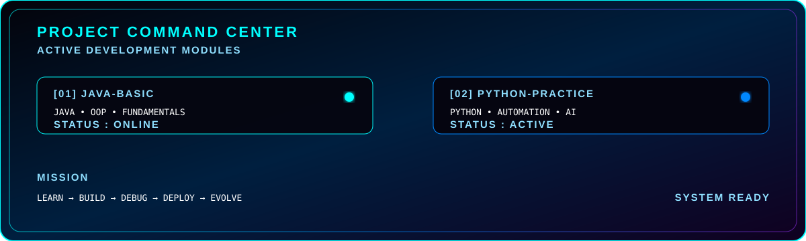
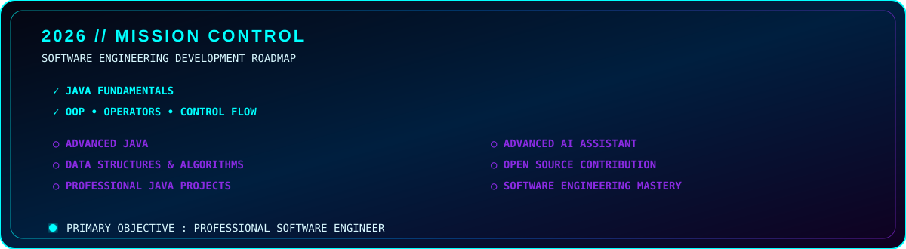
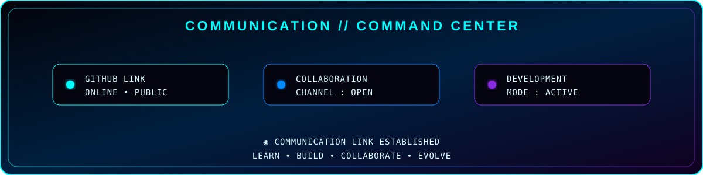

# ⚡ NIKHIL ARYA PRAJAPATI

<p align="center">
  
</p>

<p align="center">
  
</p>

<p align="center">
  
  
  
</p>

---

<p align="center">
  
</p>

---

## 🛰️ J.A.R.V.I.S // SYSTEM CORE

<p align="center">
  
</p>

<p align="center">
  
</p>

<p align="center">
  
  
  
</p>

<p align="center">
  <sub>◉ J.A.R.V.I.S CORE INITIALIZED • SYSTEM READY • DEVELOPMENT MODE ◉</sub>
</p>

---

## 👨‍💻 ABOUT // NIKHIL

<p align="center">
  
  
  
</p>

<p align="center">
  
</p>

<p align="center">

💻 Computer Science Student  
☕ Java Developer in Progress  
🤖 AI & JARVIS-Style Systems  
🐧 Linux & Development Environment  
🧠 Software Engineering & SDLC  
🚀 Building Toward Professional Software Development

</p>

<p align="center">
  <sub>◉ DEVELOPMENT CORE INITIALIZED • BUILD MODE ACTIVE ◉</sub>
</p>

---

## 🧠 TECH ARSENAL // CORE MODULES

<p align="center">
  
  
  
  
</p>

<p align="center">
  
</p>

<p align="center">
  
  
  
  
</p>

```text
╔══════════════════════════════════════════════════════╗
║              TECHNOLOGY MATRIX                      ║
╠══════════════════════════════════════════════════════╣
║                                                      ║
║  JAVA        ████████████████░░░░   CORE             ║
║  PYTHON      █████████████░░░░░░   ACTIVE           ║
║  LINUX       ███████████░░░░░░░░   LEARNING         ║
║  GIT         ████████████░░░░░░░   ACTIVE           ║
║  AI          ████████░░░░░░░░░░   DEVELOPING       ║
║  SQL         ███████░░░░░░░░░░░   LEARNING         ║
║                                                      ║
╚══════════════════════════════════════════════════════╝
<p align="center"> <sub>◉ TECHNOLOGY MATRIX INITIALIZED • MODULES EVOLVING ◉</sub> </p>

---

🚀 PROJECT COMMAND CENTER
<p align="center">  </p> <p align="center"> <a href="https://github.com/nikhilaryaprajapati122/Java-Basic">  </a>

  

<a href="https://github.com/nikhilaryaprajapati122/python-practice">  </a> </p>

╔══════════════════════════════════════════════════════╗
║             PROJECT COMMAND CENTER                  ║
╠══════════════════════════════════════════════════════╣
║                                                      ║
║  [01] JAVA-BASIC                                    ║
║      CORE   : Java / OOP                            ║
║      STATUS : ● ACTIVE                              ║
║                                                      ║
║  [02] PYTHON-PRACTICE                               ║
║      CORE   : Python                                ║
║      STATUS : ● ACTIVE                              ║
║                                                      ║
╚══════════════════════════════════════════════════════╝


💻 TERMINAL // NIKHIL-CORE
<p align="center">  </p>
<p align="center"> <sub>◉ PROJECT MODULES ONLINE • BUILDING IN PROGRESS ◉</sub> </p>

┌──(nikhil㉿github)-[~/core]
└─$ systemctl status nikhil-core

● nikhil-core.service
   STATUS : ONLINE
   MODE   : DEVELOPMENT

┌──(nikhil㉿github)-[~/core]
└─$ mission --current

> MASTER SOFTWARE ENGINEERING
> BUILD PROFESSIONAL PROJECTS
> DEVELOP AI SYSTEMS

STATUS: ███████████████████░░ ACTIVE

📈 CONTRIBUTION // ACTIVITY
<p align="center">  </p> <p align="center"> <sub>◉ CONTRIBUTION NETWORK • DEVELOPMENT ACTIVITY ◉</sub> </p>

🐍 CONTRIBUTION // NEURAL ACTIVITY
<p align="center">  </p> <p align="center">  </p> <p align="center"> <sub>◉ CONTRIBUTION SIGNALS • DEVELOPMENT ACTIVITY • CORE EVOLUTION ◉</sub> </p>
🎯 2026 // MISSION CONTROL
<p align="center">  </p>
╔══════════════════════════════════════════════════════╗
║                 2026 MISSION CONTROL                ║
╠══════════════════════════════════════════════════════╣
║                                                      ║
║  [✓] JAVA FUNDAMENTALS                              ║
║  [✓] OOP + OPERATORS + CONTROL FLOW                 ║
║  [ ] ADVANCED JAVA                                  ║
║  [ ] DATA STRUCTURES & ALGORITHMS                   ║
║  [ ] PROFESSIONAL JAVA PROJECTS                     ║
║  [ ] ADVANCED AI ASSISTANT                         ║
║  [ ] OPEN SOURCE CONTRIBUTION                       ║
║                                                      ║
║  PRIMARY OBJECTIVE : SOFTWARE ENGINEER              ║
║  SYSTEM MODE        : LEARN → BUILD → MASTER       ║
║                                                      ║
╚══════════════════════════════════════════════════════╝
📡 CONTACT // COMMAND CENTER
<p align="center">  </p> <p align="center"> <a href="https://github.com/nikhilaryaprajapati122">  </a>   </p> <p align="center"> <sub>◉ COMMUNICATION LINK ACTIVE • OPEN FOR COLLABORATION ◉</sub> </p>
<p align="center">  </p> ```
