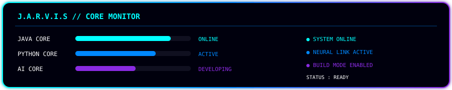

# ⚡ NIKHIL ARYA PRAJAPATI

  

  

  
  
  

---

  

---

## 🛰️ J.A.R.V.I.S // SYSTEM CORE

  

  

  
  
  

---

## 👨‍💻 ABOUT // NIKHIL

  
  
  

  

  <b>Computer Science Student • Software Developer in Progress • Builder</b>

  Exploring <b>Java</b>, <b>Software Engineering</b>, <b>AI</b> and <b>Linux</b> while building practical projects and strengthening professional development skills.

☕ <b>JAVA</b> &nbsp; • &nbsp;
🤖 <b>AI</b> &nbsp; • &nbsp;
🐧 <b>LINUX</b> &nbsp; • &nbsp;
🧠 <b>SOFTWARE ENGINEERING</b>

---

## 🧠 TECH ARSENAL // CORE MODULES

  
  
  
  

  

  
  
  
  

  ◉ TECHNOLOGY MATRIX INITIALIZED • MODULES EVOLVING ◉

---

## 🚀 PROJECT COMMAND CENTER

  

  ☕ JAVA CORE MODULE • FUNDAMENTALS → OOP → ADVANCED

  

  🐍 PYTHON MODULE • PRACTICE → BUILD → AUTOMATE

  <b>⚡ PROJECTS ARE ACTIVE DEVELOPMENT MODULES ⚡</b>

---

## 💻 TERMINAL // NIKHIL-CORE

  

  ◉ TERMINAL LINK ACTIVE • CORE PROCESS RUNNING ◉

## 🧬 SYSTEM // DEVELOPMENT MATRIX

  
  
  

  
  
  

  

  
    JAVA CORE • AI DEVELOPMENT • LINUX SYSTEMS • SOFTWARE ENGINEERING
  

---

## 🔥 CONTRIBUTION // STREAK

  

## 📈 CONTRIBUTION // ACTIVITY

  

  ◉ CONTRIBUTION NETWORK • DEVELOPMENT ACTIVITY ◉

---

## 🐍 CONTRIBUTION // SNAKE

  

  

---

## 🎯 2026 // MISSION CONTROL

  
  
  

  <b>MISSION OBJECTIVES</b>

✅ Java Fundamentals  
&nbsp;&nbsp;•&nbsp;&nbsp;
✅ OOP & Control Flow  
&nbsp;&nbsp;•&nbsp;&nbsp;
⬜ Advanced Java  

⬜ Data Structures & Algorithms  
&nbsp;&nbsp;•&nbsp;&nbsp;
⬜ Professional Java Projects  
&nbsp;&nbsp;•&nbsp;&nbsp;
⬜ Advanced AI Assistant  

⬜ Open Source Contribution  
&nbsp;&nbsp;•&nbsp;&nbsp;
⬜ Professional Software Engineering

  

  LEARN → BUILD → DEBUG → IMPROVE → MASTER

---

## 📡 CONTACT // COMMAND CENTER

  
  

  ◉ COMMUNICATION LINK ACTIVE • BUILDING WITH PURPOSE ◉

---

  

  <b>⚡ KEEP BUILDING • KEEP LEARNING • KEEP EVOLVING ⚡</b>

