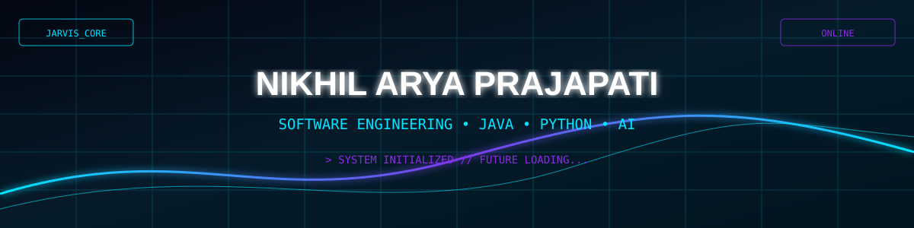

 

  

---

# ⚡ SYSTEM ONLINE

╔══════════════════════════════════════════════════════════╗
║                 N I K H I L   A I   C O R E             ║
╠══════════════════════════════════════════════════════════╣
║ STATUS       : ONLINE                                    ║
║ MODE         : DEVELOPMENT                               ║
║ SYSTEM       : BUILDING                                  ║
║ PRIMARY      : JAVA                                      ║
║ SECONDARY    : PYTHON                                    ║
║ MISSION      : SOFTWARE ENGINEERING                      ║
║ AI PROJECT   : J.A.R.V.I.S.                              ║
╚══════════════════════════════════════════════════════════╝

🧠 ABOUT ME

> Initializing Nikhil Arya Prajapati...

[✓] BSc Computer Science Student
[✓] Learning Java from Zero → Advanced
[✓] Exploring Python & Artificial Intelligence
[✓] Learning Software Engineering
[✓] Building futuristic web interfaces
[✓] Building my own J.A.R.V.I.S. system
[✓] Improving every single day

> Mission:
> Learn → Build → Break → Debug → Improve → Repeat

⚙️ TECH ARSENAL
Languages

Tools & Environment
 

🖥️ TERMINAL

┌──[ NIKHIL@JARVIS ]──[ ~/system ]

└─$ whoami

Nikhil Arya Prajapati

└─$ current_focus

Java
Software Engineering
Python
AI / J.A.R.V.I.S.

└─$ system_status

████████████████████████████████████ 100%

SYSTEM ONLINE

🚀 PROJECT COMMAND CENTER

 <table align="center"> <tr> <td width="50%" align="center">
🤖 J.A.R.V.I.S.

Personal AI assistant project built with Python.

STATUS: ACTIVE DEVELOPMENT

</td> <td width="50%" align="center">
🌌 NEXUS FUTURISTIC PORTFOLIO

Futuristic personal portfolio with neon/cyber UI.

STATUS: ACTIVE

</td> </tr> </table>
📊 GITHUB SYSTEM ANALYTICS

   

🔥 CONTRIBUTION MATRIX
 

🐍 CONTRIBUTION SNAKE
 

🎯 CURRENT MISSION
[████████████████████░░] 90%

01 → Master Java
02 → Learn OOP deeply
03 → Learn Data Structures & Algorithms
04 → Improve Python
05 → Build AI projects
06 → Learn professional Software Engineering
07 → Build powerful real-world projects
08 → Become a professional Software Engineer

🌐 CONNECT WITH ME

  

SYSTEM OFFLINE... BUT THE MISSION CONTINUES.

 
